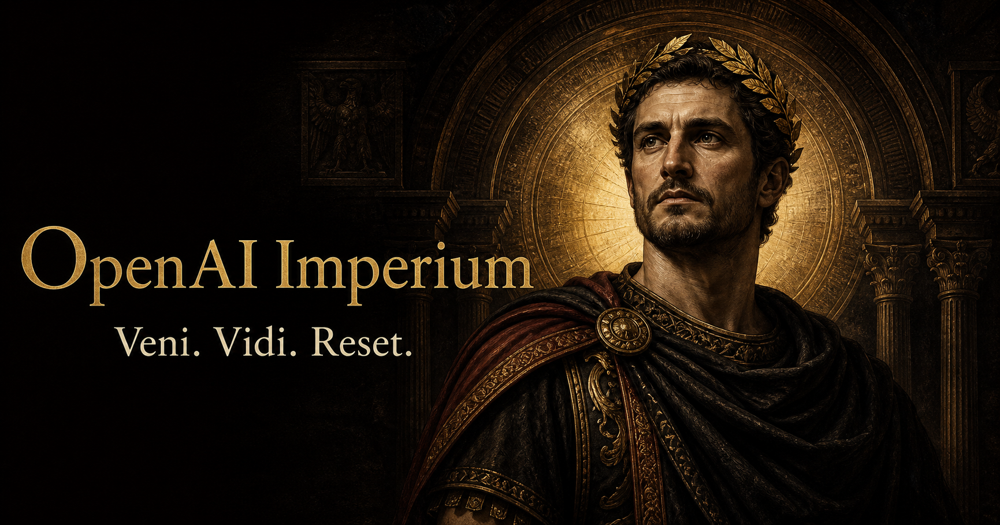

# OpenAI Imperium Reset 请愿站

[仓库入口](../README.zh-CN.md) · [English](README.md) ·
[访问请愿站](https://openai-imperium-reset.yijie4188.chatgpt.site/)

这份文档介绍仓库根目录运行的请愿站。CordisX 插件的使用、配置与开发说明见
[`plugin/README.md`](../plugin/README.md#中文)。

OpenAI Imperium 是一个非官方、戏剧化的 Codex Reset 请愿站。拖动升阶控件，
见证人物经过六个愈发帝王化的状态；提交一份真实请愿，并在公开档案中查看历史
请愿与已经获准的 Reset。



## 从疲惫书记官到 Codex Maximus

这个体验把普通的思考强度控件变成一场微型升阶仪式。随着控件向最终档推进，
肖像、材质、字体、背景、粒子与桂冠效果会共同演化。

Reset 按钮每次只推进一个阶位，同时记录一份真实请愿。当 Reset 获准时，受保护
的管理操作会结束本轮、把结果写入历史档案，然后开启新一轮计数。

## 已有能力

- 六组相互配合的肖像与界面状态。
- 带拟物手感、支持键盘操作的强度控件与 Reset 按钮。
- 从塑料、青铜、白银到黄金的连续材质变化。
- 高阶状态下由算法生成的粒子与桂叶动画。
- 由 Cloudflare D1 持久保存的请愿账本。
- 类似 GitHub Contribution Graph 的请愿与 Reset 历史日历。
- 受 Bearer Token 保护的管理 Reset 接口。
- 已公开发布、支持响应式布局并带有分享预览与 favicon 的站点。

## 本地运行

请在仓库根目录运行以下命令，使用 Node.js 22.13 或更高版本：

```bash
npm install
npm run dev
```

生成生产构建：

```bash
npm run build
```

持久账本使用 [`.openai/hosting.json`](../.openai/hosting.json) 中声明的 `DB` D1 binding。生产环境执行
Reset 还需要托管的 `RESET_ADMIN_TOKEN` secret，请勿把它提交到仓库。

源代码和素材的授权边界见[仓库许可证与声明](../README.zh-CN.md#许可证与声明)。
